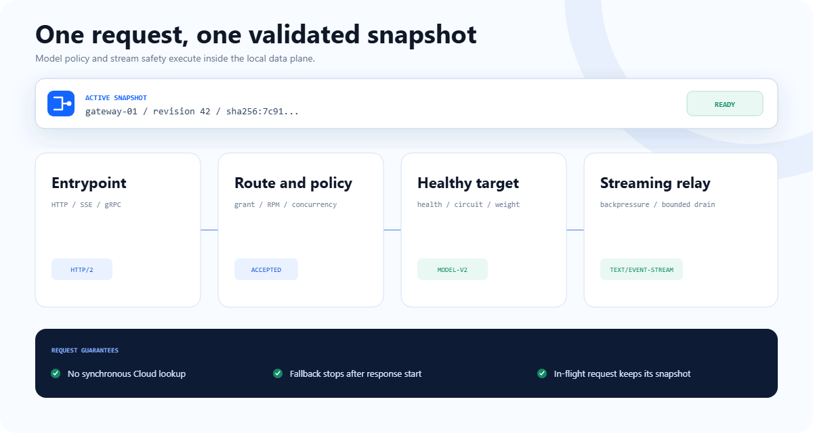

<p align="center">
  
</p>

<p align="center">
  <strong>A single Rust data plane for routing, protecting, and streaming AI traffic.</strong>
</p>

<p align="center">
  <a href="https://github.com/A3S-Lab/Gateway/actions/workflows/ci.yml"></a>
  <a href="https://github.com/A3S-Lab/Gateway/releases/latest"></a>
  <a href="https://crates.io/crates/a3s-gateway"></a>
  <a href="https://www.rust-lang.org/"></a>
  <a href="LICENSE"></a>
</p>

<p align="center">
  <a href="https://a3s-lab.github.io/Gateway/">Product website</a> &middot;
  <a href="https://a3s-lab.github.io/a3s/en/docs/gateway">Documentation</a> &middot;
  <a href="#install-in-one-command">Install</a> &middot;
  <a href="#first-request">Quick start</a> &middot;
  <a href="#feature-map">Features</a> &middot;
  <a href="#product-boundaries">Status</a> &middot;
  <a href="ROADMAP.md">Roadmap</a>
</p>

---

**A3S Gateway** accepts HTTP, SSE, WebSocket, gRPC, TCP, and UDP traffic,
evaluates each request against one validated runtime snapshot, and forwards it
to an allowed healthy backend. Configuration is compiled before cutover. A
failed startup or reload leaves the prior proven snapshot serving traffic.

Run it from operator-owned ACL in `standalone` mode or let A3S Cloud deliver
complete snapshots in `cloud-managed` mode. Gateway owns protocol fidelity and
local enforcement. A3S Cloud owns human-facing operations, tenants, workload
placement, production rollout, managed replica decisions, and the long-term
usage ledger. No synchronous Cloud call sits on the request path.

<p align="center">
  
</p>

<p align="center">
  <sub><a href="website/assets/request-path-demo.svg">Static request-path diagram</a> · the animation is conceptual; every labeled boundary maps to the implemented runtime contract.</sub>
</p>

## Install in one command

The release installers detect the operating system and architecture, download
the matching archive and published checksum, require an exact SHA-256 match,
verify the binary-reported version, and only then replace the user-local
binary.

macOS or Linux:

```bash
curl --proto '=https' --tlsv1.2 -LsSf https://a3s-lab.github.io/Gateway/install.sh | sh
```

Windows PowerShell:

```powershell
[Net.ServicePointManager]::SecurityProtocol = [Net.ServicePointManager]::SecurityProtocol -bor [Net.SecurityProtocolType]::Tls12; irm https://a3s-lab.github.io/Gateway/install.ps1 | iex
```

Defaults:

| Platform | Architectures | Install location |
| --- | --- | --- |
| Linux | x86_64, ARM64 | `~/.local/bin/a3s-gateway` |
| macOS | Intel, Apple silicon | `~/.local/bin/a3s-gateway` |
| Windows | x86_64, ARM64 | `%LOCALAPPDATA%\A3S\bin\a3s-gateway.exe` |

Pin a release or choose an install directory:

```bash
curl --proto '=https' --tlsv1.2 -LsSf https://a3s-lab.github.io/Gateway/install.sh \
  | sh -s -- --version 1.0.12 --install-dir "$HOME/.local/bin"
```

```powershell
$env:A3S_GATEWAY_VERSION = "1.0.12"
$env:A3S_GATEWAY_INSTALL_DIR = "$HOME\bin"
irm https://a3s-lab.github.io/Gateway/install.ps1 | iex
```

Homebrew and Cargo remain supported:

```bash
brew install a3s-lab/tap/a3s-gateway
# or
cargo install a3s-gateway
```

See the [latest release](https://github.com/A3S-Lab/Gateway/releases/latest)
for native archives and checksums. The installer sources are intentionally
small and auditable: [`install.sh`](install.sh) and
[`install.ps1`](install.ps1).

## First request

With an HTTP or OpenAI-compatible backend listening on `127.0.0.1:8000`, save
this as `gateway.acl`:

```acl
mode { kind = "standalone" }

entrypoints "web" {
  address = "127.0.0.1:8080"
}

routers "models" {
  rule        = "PathPrefix(`/v1`)"
  service     = "models"
  entrypoints = ["web"]
  middlewares = ["rate-limit"]
}

services "models" {
  load_balancer {
    strategy             = "least-connections"
    request_timeout      = "30s"
    stream_idle_timeout  = "5m"
    stream_total_timeout = "60m"
    servers = [{ url = "http://127.0.0.1:8000" }]

    health_check {
      path                 = "/health"
      interval             = "10s"
      timeout              = "5s"
      unhealthy_threshold = 3
      healthy_threshold   = 1
    }
  }
}

middlewares "rate-limit" {
  type  = "rate-limit"
  rate  = 60
  burst = 10
}
```

Validate the complete policy before opening a listener, inspect the compiled
shape, then start Gateway:

```bash
a3s-gateway validate --config gateway.acl
a3s-gateway config --config gateway.acl summary
a3s-gateway --config gateway.acl
```

Send traffic through the configured route:

```bash
curl http://127.0.0.1:8080/v1/models
```

Validation uses the same production constructors as startup and reload. It
checks references, listener policy, middleware configuration, health bounds,
feature requirements, and operating-mode isolation before traffic changes.

## Why this gateway exists

AI traffic stresses assumptions that are harmless for short JSON APIs.

| Workload reality | Gateway mechanism |
| --- | --- |
| Responses can stream for minutes | Full-duplex relay, downstream backpressure, and separate first-response, idle-stream, and total-operation bounds |
| Backends are expensive and can fail unevenly | Four load-balancing strategies, active and passive health, circuit state, failover, and pre-response retry/fallback |
| Policy changes must not interrupt active traffic | Complete validation, serialized lifecycle transactions, atomic snapshot swap, and prior-snapshot retention |
| Model access is identity and generation sensitive | Snapshot-local authentication, endpoint/model grants, request limits, model rewriting, and ordered healthy targets |
| A remote control plane cannot be a hot-path dependency | Complete Cloud snapshots are executed locally; the Node API is machine-only and bounded |

## Feature map

| Area | Implemented capability |
| --- | --- |
| Protocols | HTTP/1.1, HTTP/2, SSE, WebSocket, native gRPC over h2c, TCP, UDP, TLS termination, and certificate-verified HTTP/HTTPS upstreams |
| Routing | Host, path, method, header, and SNI rules; explicit priority; static revision weights; request mirroring |
| Balancing and health | Round-robin, weighted, least-connections, random, active probes, passive eviction/recovery, sticky sessions, and failover services |
| Policy pipeline | API key, Basic Auth, JWT, forward auth, local/Redis rate limits, retry, circuit breaker, CORS, headers, prefix stripping, body limits, compression, IP allowlists, and TCP filtering |
| Safe lifecycle | Fail-closed startup, atomic reload, listener reconciliation, health-check task ownership, bounded graceful drain, and exact shutdown joining |
| Managed OpenAI | Models, chat completions, legacy completions, embeddings, grants, request IDs, request/concurrency admission, rewriting, health-aware targets, and pre-response fallback |
| Evidence | Structured JSON access logs, W3C/B3 inbound trace context, W3C outbound propagation, Prometheus metrics, service telemetry, and durable prompt-free request/attempt usage records |
| Providers | File watcher, HTTP discovery, Docker labels, and optional Kubernetes Ingress/Scale integration |
| Security | Rustls, TLS/mTLS on the Node API, IP/token guards, redacted managed policy, optional `wire` secret/PII inspection, and no shell evaluation for agent commands |
| Embedding | CLI binary plus public Rust library boundaries for configuration, routing, services, agents, Skills, and lifecycle control |

### Protocol guarantees

- HTTP, SSE, and gRPC bodies preserve downstream backpressure.
- gRPC relays HTTP/2 DATA and trailers in both directions.
- WebSocket validates and establishes the upstream handshake before returning
  `101`, then relays application messages opaquely.
- Hop-by-hop headers, including fields nominated by `Connection`, do not cross
  proxy boundaries.
- Retries and managed target fallback stop after an upstream response begins.
- Selected mirrors buffer only the request needed for exact shadow replay;
  upstream responses stay on the streaming path.

## Architecture

<p align="center">
  
</p>

| Mode | Desired-state owner | Gateway responsibility |
| --- | --- | --- |
| `standalone` | Local operator ACL | Validate and execute local traffic, middleware, health, provider, and optional experimental scaling policy |
| `cloud-managed` | A3S Cloud | Enforce isolation and execute one complete, identity-bound, expiring traffic snapshot |

Changing desired-state authority requires a process restart. Managed bootstrap
ACL may bind process-local settings and the Node API, but it cannot carry local
traffic routes, services, middleware, or inference policy.

### Machine-only Node API

The historical `management` ACL block now configures a bounded Node API. It is
not a web console and does not expose active configuration, routes, services,
backends, audit events, raw ACL validation, or raw reload endpoints.

```acl
management {
  enabled        = true
  address        = "127.0.0.1:9090"
  path_prefix    = "/api/gateway"
  auth_token_env = "A3S_GATEWAY_NODE_TOKEN"
  allowed_ips    = ["127.0.0.1", "::1"]
}
```

The remaining machine contract is intentionally small:

| Endpoint | Purpose |
| --- | --- |
| `GET /health` | Process state, mode, Gateway identity, connections, request count, and usage-spool health |
| `GET /metrics` | Prometheus text exposition |
| `GET /version` | Binary and Node API version |
| `POST /snapshots/apply` | Apply a complete identity/revision/CAS/digest/expiry-bound Cloud snapshot |
| `GET /snapshots/status` | Report exact instance-local managed readiness |

All paths are under the configured `path_prefix`. Human-facing operations and
production orchestration belong in A3S Cloud.

## Managed OpenAI traffic

Gateway recognizes exactly four managed endpoint profiles:

| Endpoint | Local behavior |
| --- | --- |
| `GET /v1/models` | Return a stable model catalog filtered to the credential's grants |
| `POST /v1/chat/completions` | Validate, authorize, rewrite, dispatch, and optionally stream chat requests |
| `POST /v1/completions` | Apply the same closed policy to legacy completion requests |
| `POST /v1/embeddings` | Apply the closed policy to embedding requests |

The request body limit is fixed at 8 MiB. Unknown and near-miss paths remain
ordinary routed traffic. Client authorization is removed before upstream
dispatch, and Gateway replaces client-supplied request/attempt identity headers.

## Coding-agent and Skill utilities

The same binary includes a separate, non-hot-path process surface for native
coding-agent CLIs and standard `SKILL.md` packages:

```bash
a3s-gateway agent list
a3s-gateway agent exec codex --workspace . -- --help
a3s-gateway skill list --workspace . --agent codex
a3s-gateway skill run review \
  --agent codex \
  --workspace . \
  --task "Review this routing change"
```

Built-in profiles cover A3S Code, Claude Code, Codex, Gemini CLI, and OpenCode.
Arguments go directly to the child process without shell evaluation. Custom
executables use the same typed registry boundary.

## Product boundaries

The roadmap is gate-driven. A local implementation is not described as a
production capability until its cross-component evidence is closed.

| Status | Capability |
| --- | --- |
| **Available** | Core protocols, routing, balancing, health, TLS, middleware, atomic reload, bounded drain, static revision weights/mirroring, managed snapshots, managed OpenAI request paths, structured access logs, non-token telemetry, local durable usage spool, Node API, agent profiles, and Skills |
| **Experimental** | Standalone scale-to-zero and autoscaling, including Kubernetes Scale integration; real-cluster and complete Box/control-plane recovery evidence remains open |
| **Unavailable** | Automatic gradual rollout. `rollout {}` syntax is retained only to return an explicit validation error; use static revision weights today |
| **Open across Gateway + Cloud** | Trusted token accounting, per-grant token-budget enforcement, usage batch/ACK upload and ingestion, private upstream identity, mixed-version HA, placement and rollout thresholds, load/disaster-recovery gates |
| **Planned** | Native MCP or remote Agent data plane after the identity/session/route/deployment contract closes; A2A remains uncommitted |

See [`ROADMAP.md`](ROADMAP.md) for exit criteria, ownership, and recommended
merge order.

## Deploy or embed

Docker:

```bash
docker run --rm \
  -v "$PWD/gateway.acl:/etc/gateway/gateway.acl:ro" \
  -p 8080:8080 \
  ghcr.io/a3s-lab/gateway:latest \
  --config /etc/gateway/gateway.acl
```

Helm:

```bash
helm install gateway deploy/helm/a3s-gateway \
  --set image.repository=ghcr.io/a3s-lab/gateway \
  --set-file config=./gateway.acl
```

Rust library:

```bash
cargo add a3s-gateway
```

Optional Cargo features:

| Feature | Adds |
| --- | --- |
| `redis` | Distributed Redis-backed rate limiting |
| `kube` | Kubernetes Ingress provider and Scale executor |
| `wire` | Inline LLM/MCP secret and PII inspection through `a3s-sentry` |

## Development

Rust 1.88 or newer is required.

```bash
cargo fmt --all -- --check
cargo clippy --all-targets -- -D warnings
cargo test --locked
bash scripts/test-install.sh
python website/scripts/check_site.py
node --check website/app.js
```

The PowerShell installer contract runs on Windows PowerShell 5.1 and
PowerShell 7 in CI. Official OpenAI SDK conformance also runs on Linux and
Windows.

## Documentation and license

- [Product website](https://a3s-lab.github.io/Gateway/)
- [Gateway documentation](https://a3s-lab.github.io/a3s/en/docs/gateway)
- [Release process](RELEASING.md)
- [Changelog](CHANGELOG.md)
- [Roadmap](ROADMAP.md)

Licensed under the [MIT License](LICENSE).
