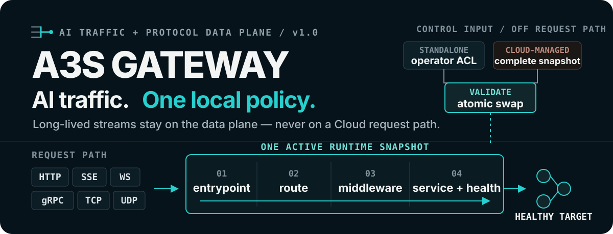
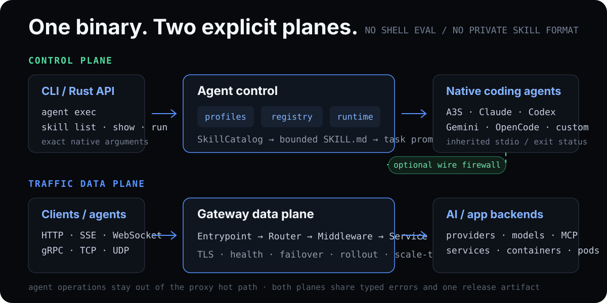

<p align="center">
  
</p>

<p align="center">
  <strong>One Rust binary for local coding-agent operations and the AI traffic behind them.</strong>
</p>

<p align="center">
  <a href="https://github.com/A3S-Lab/Gateway/actions/workflows/ci.yml"></a>
  <a href="https://github.com/A3S-Lab/Gateway/releases/latest"></a>
  <a href="https://crates.io/crates/a3s-gateway"></a>
  <a href="https://www.rust-lang.org/"></a>
  <a href="LICENSE"></a>
</p>

<p align="center">
  <a href="https://a3s-lab.github.io/Gateway/">Website</a> ·
  <a href="#start-with-coding-agents">Agent CLI + Skills</a> ·
  <a href="#run-your-first-traffic-gateway">Traffic quick start</a> ·
  <a href="#one-request-path">Request path</a> ·
  <a href="#operating-modes">Modes</a> ·
  <a href="#managed-openai-traffic">OpenAI</a> ·
  <a href="#management-and-observability">Operations</a> ·
  <a href="#product-boundaries">Status</a>
</p>

---

**A3S Gateway** gives local operators one typed surface for discovering and
starting native coding-agent CLIs, selecting standard `SKILL.md` packages, and
running a task with an explicit Skill. The same binary accepts AI traffic,
applies one validated runtime snapshot, selects an allowed healthy backend,
and relays long-lived application protocols without placing A3S Cloud on the
request path.

It runs independently from operator-owned ACL configuration or as the local
data plane for an A3S Cloud deployment. Gateway owns protocol handling and
policy enforcement. Its agent operations surface starts native processes; it
does not replace those agents or own their sessions. Gateway also does not own
tenants, workload placement, production rollout, managed replica counts, or
the long-term usage ledger.

## Start with coding agents

Install the latest stable binary in one command.

macOS or Linux:

```bash
curl --proto '=https' --tlsv1.2 -LsSf https://a3s-lab.github.io/Gateway/install.sh | sh
```

Windows PowerShell:

```powershell
[Net.ServicePointManager]::SecurityProtocol = [Net.ServicePointManager]::SecurityProtocol -bor [Net.SecurityProtocolType]::Tls12; irm https://a3s-lab.github.io/Gateway/install.ps1 | iex
```

The installers detect the operating system and architecture, download the
matching release archive and published checksum, require an exact SHA-256
match, verify the binary-reported version, and only then replace the per-user
binary. The POSIX default is `~/.local/bin`; Windows uses
`%LOCALAPPDATA%\A3S\bin` and updates the user `PATH`. Pass `--help` to
`install.sh`, or inspect [`install.ps1`](install.ps1) for PowerShell parameters.
When a release predates native Windows archives, the PowerShell installer uses
an existing Cargo toolchain as an explicit fallback instead of accepting an
unverified asset.

Pin a version or install directory without changing the scripts:

```bash
curl --proto '=https' --tlsv1.2 -LsSf https://a3s-lab.github.io/Gateway/install.sh \
  | sh -s -- --version 1.0.12 --install-dir "$HOME/.local/bin"
```

Homebrew and Cargo remain supported alternatives:

```bash
brew install a3s-lab/tap/a3s-gateway
# or
cargo install a3s-gateway
```

Release archives and checksums are available from the
[latest release](https://github.com/A3S-Lab/Gateway/releases/latest). The
release workflow adds native Windows ZIP assets to every new tag.

Inspect the built-in profiles, then pass native arguments to the selected CLI:

```bash
a3s-gateway agent list
a3s-gateway agent inspect codex
a3s-gateway agent exec codex --workspace . -- --help
```

| Profile | Native task contract | Agent-specific Skill root |
| --- | --- | --- |
| `a3s` | `a3s code exec <task>` | `.a3s/skills` |
| `claude` | `claude --print <task>` | `.claude/skills` |
| `codex` | `codex exec <task>` | `.codex/skills` |
| `gemini` | `gemini --prompt <task>` | `.gemini/skills` |
| `opencode` | `opencode run <task>` | `.opencode/skills` |

An unknown profile is accepted only with an explicit executable. Arguments are
passed directly to the child process—never through a shell:

```bash
a3s-gateway agent exec my-agent \
  --command /opt/agents/my-agent \
  --workspace . \
  -- --native-flag "two words"
```

### Discover and run Skills

Gateway reads standard `<name>/SKILL.md` packages from shared and agent-native
roots. Explicit `--skill-dir` roots win first, then workspace roots, then user
roots; the first valid occurrence of a Skill name wins.

```bash
a3s-gateway skill list --workspace .
a3s-gateway skill list --workspace . --agent codex --json
a3s-gateway skill show review --workspace .
a3s-gateway skill path review --workspace .
a3s-gateway skill run review \
  --agent codex \
  --workspace . \
  --task "Review the routing change and run focused tests"
```

General discovery covers `.agents/skills`, `.a3s/skills`, `.claude/skills`,
`.codex/skills`, `.gemini/skills`, `.opencode/skills`, and `.cursor/skills` in
both the workspace and user home. A profile-filtered operation keeps the shared
`.agents/skills` root plus that profile's native root. Skill files are UTF-8,
read-only, and bounded to 256 KiB. `skill run` resolves the selected file to an
explicit path, injects that path into the task, and starts the profile's native
task command with inherited terminal streams and exit status.

The public Rust API exposes the same `AgentProfile`, `AgentRegistry`,
`AgentRuntime`, `SkillDiscovery`, and `SkillCatalog` boundaries so embedders can
register another typed profile without adding vendor branches to the runtime.

## Run your first traffic gateway

With an HTTP or OpenAI-compatible backend listening on `127.0.0.1:8000`, save
this as `gateway.acl`:

```acl
mode { kind = "standalone" }

entrypoints "web" {
  address = "127.0.0.1:8080"
}

routers "models" {
  rule        = "PathPrefix(`/v1`)"
  service     = "models"
  entrypoints = ["web"]
  middlewares = ["rate-limit"]
}

services "models" {
  load_balancer {
    strategy             = "least-connections"
    request_timeout      = "30s"
    stream_idle_timeout  = "5m"
    stream_total_timeout = "60m"
    servers = [{ url = "http://127.0.0.1:8000" }]
    health_check { path = "/health" }
  }
}

middlewares "rate-limit" {
  type  = "rate-limit"
  rate  = 60
  burst = 10
}
```

Validate the complete policy before binding a listener, inspect what Gateway
compiled, then start it:

```bash
a3s-gateway validate --config gateway.acl
a3s-gateway config --config gateway.acl summary
a3s-gateway --config gateway.acl
```

Traffic now follows the configured route:

```bash
curl http://127.0.0.1:8080/v1/models
```

## One request path

Every accepted request is evaluated against one immutable runtime snapshot:

```text
operator ACL ───────┐
                    ├─> validate ─> atomic swap ─> active snapshot
A3S Cloud snapshot ─┘                              │
                                                   │
client ─> entrypoint ─> route ─> middleware ─> service ─> healthy backend
```

This separation is the central contract:

- configuration is validated and compiled before cutover;
- a rejected reload leaves the prior proven snapshot active;
- local health may suppress an endpoint but can never invent one;
- retries and managed fallback stop once an upstream response begins;
- ordinary response bodies and streams preserve backpressure; and
- shutdown closes listeners first, drains accepted work within a configured
  deadline, then cancels and joins what remains.

No request needs a synchronous Cloud API, database, or scheduler round trip.

## What Gateway handles

- **Coding-agent operations** — typed profiles for A3S Code, Claude Code,
  Codex, Gemini CLI, and OpenCode; exact native argument passthrough; custom
  executable registration; and bounded, precedence-aware `SKILL.md` discovery
  and task execution.
- **Traffic and streaming** — HTTP/1.1, HTTP/2, SSE, WebSocket, gRPC, TCP,
  UDP, TLS termination, and bounded graceful drain.
- **Routing and backend policy** — host, path, method, header, and SNI rules;
  round-robin, weighted, least-connections, and random selection; active and
  passive health; sticky sessions; failover; mirroring; and static revision
  weights.
- **Policy enforcement** — authentication, request limits, retries before
  response, circuit state, CORS, headers, compression, and network controls.
- **Safe configuration** — ACL startup validation, file/provider updates,
  serialized atomic reload, in-place supported listener-policy replacement,
  and prior-snapshot retention on failure.
- **Operations** — a dedicated Management API, Prometheus metrics,
  trace-context propagation, structured terminal access logs, and bounded
  security events.
- **Managed AI traffic** — an exact OpenAI endpoint profile, snapshot-local
  authorization, model grants and rewriting, request/concurrency admission,
  health-aware targets, pre-response fallback, and prompt-free lifecycle
  evidence.

### Protocol behavior

For HTTP-derived traffic, Gateway removes both fixed hop-by-hop fields and
every field nominated by `Connection` before crossing a proxy boundary. gRPC
retains the required `TE: trailers` request semantics and relays HTTP/2 DATA
and trailer frames without collecting ordinary calls. WebSocket regenerates
its required upgrade fields after filtering downstream options.

| Protocol | Gateway behavior |
| --- | --- |
| HTTP/1.1 and HTTP/2 | Reverse proxying, static and `Connection`-nominated hop-by-hop filtering in both directions, streaming bodies, and normalized forwarded metadata |
| SSE | Chunk relay without response buffering, bidirectional hop-by-hop filtering, and independent first-response, idle-stream, and total-operation limits |
| WebSocket | RFC 6455 opening-handshake validation, downstream `Connection`-option filtering, bounded upstream handshake before `101`, preserved non-`101` status and safe end-to-end headers with a Gateway-generated JSON body, end-to-end request-header and subprotocol forwarding, transparent tracked message relay, and bounded shutdown |
| gRPC | Full-duplex HTTP/2 h2c forwarding with DATA/trailer preservation, connection-specific filtering, and independent first-response, idle-stream, and total-operation limits; only mirror-selected calls are buffered once so the exact request can be replayed to the shadow service |
| TCP | Raw byte relay, SNI routing, IP filtering, connection limits, and bounded shutdown |
| UDP | Session-based datagram relay with current-snapshot routing and immediate shutdown cancellation |

<details>
<summary><strong>15 built-in middleware types</strong></summary>

| Middleware | Purpose |
| --- | --- |
| `jwt` | HS256 JWT validation |
| `api-key` | Header-based API key enforcement |
| `basic-auth` | HTTP Basic authentication |
| `forward-auth` | Delegated authentication through an external service |
| `rate-limit` | In-process token-bucket limiting |
| `rate-limit-redis` | Optional Redis-backed distributed limiting |
| `cors` | CORS response policy |
| `headers` | Request and response header mutation |
| `strip-prefix` | Route-prefix removal |
| `body-limit` | Request body limit |
| `retry` | Bounded retry before a response starts |
| `circuit-breaker` | Closed, open, and half-open backend state |
| `ip-allow` | CIDR and IP allowlist |
| `compress` | Brotli, gzip, or deflate response compression |
| `tcp-filter` | TCP connection and source-address policy |

Redis support requires the `redis` Cargo feature. Kubernetes discovery
requires `kube`.

</details>

## Operating modes

| Mode | Desired-state authority | Gateway responsibility |
| --- | --- | --- |
| `standalone` | Operator-owned ACL | Validate and execute local traffic, transport, middleware, health, and provider policy |
| `cloud-managed` | A3S Cloud | Enforce the managed boundary and execute one complete delivered traffic snapshot |

`standalone` is the default when the `mode` block is omitted. It may use file,
discovery, Docker, and optional Kubernetes providers.

Gradual `rollout` blocks are rejected in every mode because no live runtime
executes them. Configure explicit `revisions` `traffic_percent` weights for
static traffic splitting instead.

`cloud-managed` additionally rejects local providers, service-level scaling,
raw ACL mutation after a managed identity is active, and mode changes through
reload. Static routes, health policy, mirroring, and revision weights remain
valid because they describe data-plane execution rather than workload
lifecycle.

Changing desired-state authority always requires a process restart.

### Managed snapshot foundation

A managed Gateway starts from a small bootstrap ACL that binds process-local
settings and a stable logical identity:

```acl
mode { kind = "cloud-managed" }

managed {
  gateway_id = "019cdef0-21b0-7b2a-95b0-7f0fd02fa725"
  state_file = "/var/lib/a3s-gateway/managed-snapshot.json"
}

management {
  enabled     = true
  address     = "127.0.0.1:9090"
  path_prefix = "/api/gateway"
}
```

The Gateway-native `a3s.gateway.managed-snapshot.v1` protocol exposes:

- `POST /api/gateway/snapshots/apply` for a complete ACL snapshot; and
- `GET /api/gateway/snapshots/status` for exact instance-local readiness.

An envelope binds the Gateway ID, positive revision, expected prior revision,
exact `sha256:` digest, issue time, expiry, and complete ACL bytes. Validity is
limited to 24 hours. Exact replay is idempotent; stale, conflicting, expired,
identity-mismatched, digest-invalid, or invalid-ACL successors are rejected
without replacing the active policy.

Optional `state_file` durability restores the exact applied snapshot before
readiness after process loss. Readiness is deliberately replica-local; A3S
Cloud owns rollout thresholds and the aggregate deployment result.

## Managed OpenAI traffic

Gateway recognizes this closed request profile:

| Method and path | Behavior |
| --- | --- |
| `GET /v1/models` | Return a stable catalog filtered to the credential's granted aliases |
| `POST /v1/chat/completions` | Validate the model and select buffered or SSE behavior from `stream` |
| `POST /v1/completions` | Validate the model and select buffered or SSE behavior from `stream` |
| `POST /v1/embeddings` | Validate, authorize, rewrite the model, and proxy the request |

For policy-bound managed routes, Gateway authenticates inference keys locally,
enforces endpoint and model grants, strips client credentials, applies
per-grant request and concurrency limits, rewrites external model aliases, and
selects a healthy configured target. A lower-priority target is eligible only
before upstream response headers arrive. Any upstream status or started body
ends fallback eligibility, preventing duplicate work.

Gateway replaces untrusted correlation headers with one request UUID and a new
attempt UUID for each concrete dispatch. Terminal access logs retain bounded
route, policy, model, target, and trace context without prompts, bodies,
responses, credentials, or verifier hashes.

The pinned official `openai-python` 2.47.0 suite drives the real Gateway binary
through Models, Chat Completions, Completions, Embeddings, streaming usage,
`[DONE]`, disconnect, cancellation, graceful drain, and forced drain. See the
[SDK conformance harness](tests/openai_sdk/README.md).

> [!IMPORTANT]
> `tokens_per_minute` is validated but not yet enforced. The optional local
> usage spool records prompt-free request and attempt lifecycle evidence, not
> trusted token totals. Its transport-neutral production internals provide
> bounded ordered replay, exact gap rejection, a durable contiguous
> acknowledgement watermark, crash-safe reclamation of fully acknowledged
> closed epochs, and byte-preserving compaction of acknowledged prefixes in
> partially acknowledged closed epochs. The active append epoch is never
> replaced online; if partially acknowledged, it is compacted after becoming
> closed on the next startup. The authenticated Cloud batch/ACK contract and
> uploader, token measurement, explicit gap reconciliation, Cloud ingestion,
> and the durable Cloud ledger remain open roadmap work.

## Management and observability

The optional Management API uses a dedicated listener so operational and
mutation endpoints do not claim paths on traffic entrypoints:

```acl
management {
  enabled        = true
  address        = "127.0.0.1:9090"
  path_prefix    = "/api/gateway"
  auth_token_env = "A3S_GATEWAY_ADMIN_TOKEN"
  allowed_ips    = ["127.0.0.1", "::1"]
}

observability {
  metrics_enabled = true
}
```

It exposes health, version, active configuration, routes, services, backends,
Prometheus metrics, recent security events, and managed snapshot status.
Standalone and legacy deployments can validate or atomically reload ACL
payloads through the same listener. When the durable usage spool is configured,
health includes its highest acknowledged and oldest retained local cursors in
addition to byte, record, reservation, capacity, and writability state.

```bash
a3s-gateway management events \
  --url http://127.0.0.1:9090/api/gateway
a3s-gateway management validate \
  --url http://127.0.0.1:9090/api/gateway \
  --file gateway.acl
a3s-gateway management reload \
  --url http://127.0.0.1:9090/api/gateway \
  --file gateway.acl
```

Service telemetry includes bounded queue depth, drop-safe active requests,
request-duration and first-non-empty-chunk TTFT histograms, backend active work
and health, and per-signal observation age. Missing or stale event signals mean
unknown, never zero. Labels come only from active topology and are pruned on
reload.

## Deploy or embed

### Docker

```bash
docker run --rm \
  --volume "$(pwd)/gateway.acl:/etc/a3s-gateway/gateway.acl:ro" \
  --publish 8080:8080 \
  ghcr.io/a3s-lab/gateway:latest
```

### Helm

```bash
helm install gateway deploy/helm/a3s-gateway \
  --set-file config=gateway.acl \
  --set service.type=LoadBalancer
```

The [Helm chart](deploy/helm/a3s-gateway/) deploys Gateway. It does not make
Kubernetes the A3S Cloud scheduler or enable managed control loops.

### Rust library

The binary and public Rust API share the same configuration and lifecycle:

```rust,no_run
use std::sync::Arc;

use a3s_gateway::{config::GatewayConfig, Gateway};

#[tokio::main]
async fn main() -> a3s_gateway::Result<()> {
    let config = GatewayConfig::from_file("gateway.acl").await?;
    let gateway = Arc::new(Gateway::new(config)?);

    gateway.start().await?;
    gateway.wait_for_shutdown().await;
    Ok(())
}
```

Optional Cargo features are `redis`, `kube`, and `wire`. The `wire` feature is
a separate single-upstream local proxy built on
[A3S Sentry](https://github.com/A3S-Lab/Sentry); it masks selected text secrets
or PII and scans configured LLM/MCP traffic. It is not native MCP support, an
OpenAI dispatcher, or a replacement for host-level controls.

## Architecture

<p align="center">
  
</p>

The local agent operations surface is deliberately outside the proxy hot path.
It resolves one typed profile, one bounded Skill inventory, and one native
process invocation. It cannot mutate the active traffic snapshot merely by
starting an agent.

`Gateway` owns lifecycle and listener reconciliation. Routers and middleware
pipelines are compiled before traffic reaches services. Services own backend
selection and local health. Accepted connections, streams, and upgrades remain
owned by their entrypoint until normal completion or bounded shutdown.

In managed deployments, PostgreSQL desired state and durable operations remain
in Cloud. The node agent delivers configuration over the outbound control
channel; provider request and response bytes never pass through Cloud.

## Product boundaries

The repository distinguishes implementation from production evidence.

**Available foundations**

- local coding-agent profiles, native CLI passthrough, and read-only standard
  `SKILL.md` discovery and task selection;
- multi-protocol traffic, routing, middleware, health, TLS, static release
  policy, atomic reload, bounded drain, access logs, and Management API;
- standalone operation with file, discovery, Docker, and optional Kubernetes
  providers;
- explicit managed-mode isolation and the Gateway-native snapshot protocol;
- topology-bounded non-token service telemetry; and
- the managed OpenAI request-path and local usage-spool foundations described
  above.

**Experimental**

- standalone scale-to-zero and autoscaling;
- Kubernetes `Scale` subresource integration; and
- executor recovery that has local fixture evidence but not complete Box or
  real-cluster production conformance.

**Unavailable or still open**

- automatic gradual rollout; every service `rollout` block fails validation,
  while explicit static revision weights remain supported;
- managed production rollout thresholds, placement, and replica decisions;
- trusted token accounting, token-budget enforcement, and the authenticated
  Cloud usage uploader/ingestion contract;
- complete cross-product HA, mixed-version, load, and disaster-recovery gates;
  and
- native MCP or remote Agent protocol handling. The local CLI/Skill operations
  surface is a process bridge, not a new wire protocol.

Read the gate-driven [Roadmap](ROADMAP.md) before treating an experimental or
planned surface as production-ready.

## Development

Run checks from the repository root:

```bash
cargo fmt --all -- --check
cargo test --all-features
cargo clippy --all-targets --all-features -- -D warnings
RUSTDOCFLAGS="-D warnings" cargo doc --all-features --no-deps
```

Keep runtime modules below 1,000 lines. Large unit suites live in adjacent
`*_tests.rs` files and retain their original Rust module/test paths.

The pinned OpenAI SDK gate has its own Python dependencies and drives the real
binary. Optional Redis, Kubernetes, ACME, and host-backed integrations may need
their corresponding external services.

Tagged releases reuse the complete CI workflow instead of a reduced publish
check. Crates.io publication starts only after lint, tests, OpenAI SDK
conformance, documentation, benchmarks, Windows Rust and SDK tests, installer
contracts, MSRV, and every macOS, Linux, and Windows release build succeed. See
the [release process](RELEASING.md) for the required version and changelog
metadata.

Useful project references:

- [Project website](https://a3s-lab.github.io/Gateway/)
- [Roadmap and capability evidence](ROADMAP.md)
- [Changelog](CHANGELOG.md)
- [Release process](RELEASING.md)
- [OpenAI SDK conformance harness](tests/openai_sdk/README.md)

## Stability and license

A3S Gateway follows [Semantic Versioning](https://semver.org/). The public Rust
API, ACL configuration, Management API, and CLI are stable from `1.0.0`. The
minimum supported Rust version is 1.88.

Licensed under the [MIT License](LICENSE).
