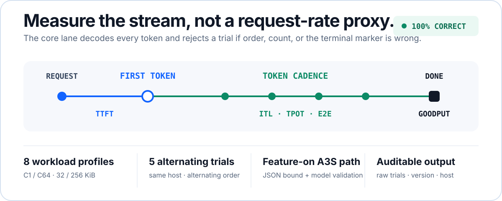

<p align="center">
  
</p>

<p align="center">
  <strong>OpenAI-compatible model policy, token-stream lifecycle, backend recovery, and atomic desired state in one local Rust data plane.</strong>
</p>

<p align="center">
  <a href="https://github.com/A3S-Lab/Gateway/actions/workflows/ci.yml"></a>
  <a href="https://github.com/A3S-Lab/Gateway/releases/latest"></a>
  <a href="https://crates.io/crates/a3s-gateway"></a>
  <a href="https://www.rust-lang.org/"></a>
  <a href="LICENSE"></a>
</p>

<p align="center">
  <a href="https://a3s-lab.github.io/Gateway/">Website</a> &middot;
  <a href="https://a3s-lab.github.io/Gateway/docs/">Documentation</a> &middot;
  <a href="#quick-start">Quick start</a> &middot;
  <a href="#ai-traffic-evidence">AI evidence</a> &middot;
  <a href="ROADMAP.md">Roadmap</a>
</p>

---

A3S Gateway sits between OpenAI-compatible clients and model backends. It
authenticates and admits requests, resolves model aliases, selects healthy
targets, and preserves streaming responses without a synchronous control-plane
hop. The same binary also routes HTTP/1.1, HTTP/2, SSE, WebSocket, gRPC, TCP,
UDP, and TLS traffic.

Use a local ACL in `standalone` mode or apply complete, revision-bound desired
state from A3S Cloud in `cloud-managed` mode. Gateway owns the live traffic
decision; Cloud owns human operations, rollout, placement, and the long-term
usage ledger.

## AI traffic evidence

<p align="center">
  
</p>

The published core comparison uses one deterministic OpenAI-compatible
upstream on the same host. It alternates A3S Gateway and NGINX five times for
each of eight profiles and rejects a trial unless every token is present, in
order, with exactly one terminal marker. That is 80 raw product trials, all
successful, with TTFT, ITL, TPOT, end-to-end latency, stream rate, and
completed-token goodput recorded.

| Workload | A3S TTFT | NGINX TTFT | TTFT ratio | ITL ratio | Token goodput ratio |
| --- | ---: | ---: | ---: | ---: | ---: |
| Zero-delay stream · C1 | 0.343 ms | 0.349 ms | 0.983× | 0.992× | 1.000× |
| Zero-delay stream · C64 | 2.438 ms | 1.184 ms | 2.059× | 0.986× | 0.924× |
| Paced stream · C16 | 51.421 ms | 51.427 ms | 1.000× | 1.000× | 1.001× |
| Paced stream · C64 | 52.274 ms | 52.152 ms | 1.002× | 0.995× | 1.001× |
| Long output | 51.877 ms | 51.848 ms | 1.001× | 1.002× | 1.000× |
| Completions endpoint | 51.450 ms | 51.811 ms | 0.993× | 0.985× | 1.001× |
| 32 KiB prompt | 51.633 ms | 51.860 ms | 0.996× | 1.013× | 1.001× |
| 256 KiB prompt | 52.928 ms | 52.660 ms | 1.005× | 0.994× | 0.998× |

A ratio above 1 means A3S took longer or NGINX produced more goodput,
depending on the column. The zero-delay C64 row exposes a real current
bottleneck; paced, long-output, endpoint, and long-prompt rows are near parity
on this hosted runner. A3S performs bounded OpenAI JSON and model validation;
NGINX is the transport-only control, so this measures feature-on path cost, not
equivalent policy capability and not production capacity.

[Raw token-aware JSON](https://a3s-lab.github.io/Gateway/assets/ai-gateway-comparison.json) ·
[exact workflow run](https://github.com/A3S-Lab/Gateway/actions/runs/31671953391) ·
[59-scenario method and backlog](benchmarks/ai-gateway-comparison/README.md)

## Quick start

Install on macOS or Linux:

```bash
curl --proto '=https' --tlsv1.2 -LsSf https://a3s-lab.github.io/Gateway/install.sh | sh
```

Install on Windows PowerShell:

```powershell
[Net.ServicePointManager]::SecurityProtocol = [Net.ServicePointManager]::SecurityProtocol -bor [Net.SecurityProtocolType]::Tls12; irm https://a3s-lab.github.io/Gateway/install.ps1 | iex
```

Cargo and Homebrew are also supported:

```bash
cargo install a3s-gateway
# or
brew install a3s-lab/tap/a3s-gateway
```

With an OpenAI-compatible backend on `127.0.0.1:8000`, save this as
`gateway.acl`:

```acl
mode { kind = "standalone" }

entrypoints "web" {
  address = "127.0.0.1:8080"
}

routers "models" {
  rule        = "PathPrefix(`/v1`)"
  service     = "models"
  entrypoints = ["web"]
}

services "models" {
  load_balancer {
    strategy             = "least-connections"
    request_timeout      = "30s"
    stream_idle_timeout  = "5m"
    stream_total_timeout = "60m"
    servers = [{ url = "http://127.0.0.1:8000" }]
  }
}
```

Validate the complete snapshot before starting it:

```bash
a3s-gateway validate --config gateway.acl
a3s-gateway config --config gateway.acl summary
a3s-gateway --config gateway.acl
curl http://127.0.0.1:8080/v1/models
```

## Why an AI traffic layer

| AI traffic requirement | Gateway mechanism |
| --- | --- |
| First-token and long-stream failure modes | Separate first-response, idle-stream, and total-operation bounds with backpressure and bounded drain |
| Model-specific access | Endpoint/model grants, alias rewriting, RPM, burst, and concurrent-request admission |
| Uneven or failing providers | Active/passive health, circuit state, weighted selection, failover, and retry only before a response starts |
| Safe policy changes | Validate and compile a complete snapshot, then atomically activate it; rejection keeps the previous runtime alive |
| Remote desired state | Apply complete Cloud snapshots while every authorized request decision stays local |
| Scale-to-zero workloads | Consume ready replica endpoints from A3S Box and release bounded requests only after the workload is routable |

This is intentionally narrower than an AI platform. Gateway does not own
tenants, deployment, placement, rollout, billing, model serving, or a human
operator UI.

## Architecture

<p align="center">
  
</p>

| Mode | Desired-state owner | Gateway responsibility |
| --- | --- | --- |
| `standalone` | Local operator and ACL | Validate and execute routes, middleware, providers, health, static revision weights, and opt-in scaling |
| `cloud-managed` | A3S Cloud | Validate and execute one complete identity-, revision-, digest-, CAS-, and expiry-bound snapshot |

Changing authority requires a process restart. Gateway exposes a machine-only
Node API for health, readiness, metrics, version, managed snapshot application,
exact snapshot status, and local usage-spool state.

### Gateway and A3S Box

Gateway and [A3S Box](https://github.com/A3S-Lab/a3s-box) solve different parts
of one request lifecycle. Gateway owns admission, routing, health, and stream
fidelity. Box owns Sandbox workload state and publishes ready replica-slot
endpoints. In standalone mode, an opt-in Box executor can scale from zero,
atomically replace the live backend pool, release a bounded waiting request,
and withdraw an endpoint before Box drains and terminates its workload.

The integration has local, real-Gateway, real-Kubernetes, and exact-revision
real Linux Box Sandbox evidence. A real MicroVM workload gate remains open, so
standalone autoscaling is still experimental. Box is not called by
`cloud-managed` traffic; Cloud remains the desired-replica authority there.

## Capability status

| Area | Status | Current boundary |
| --- | --- | --- |
| Protocol and stream plane | Available | HTTP/1.1, HTTP/2, SSE, WebSocket, native gRPC over h2c, TCP, UDP, TLS, trailers, backpressure, independent stream bounds, and bounded drain |
| Routing, middleware, health | Available | Host/path/method/header/SNI rules, built-in policies, typed Rust extensions, four balancing strategies, health, circuits, sticky sessions, failover, and mirroring |
| Snapshot lifecycle | Available | Standalone ACL and Cloud-managed modes, fail-closed validation, listener reconciliation, atomic activation, exact readiness, and optional managed-state recovery |
| Managed target delivery (`H0.2`) | Verified jointly | Released Gateway plus pinned Cloud clean-host gates cover exact apply/ACK, process loss, redelivery, conflict/expiry rejection, certificate and target-generation replacement, replica-local readiness, and protocol compatibility |
| Managed Runtime Service routes | Gateway foundation | Embedded hosts can durably bind one exact loopback Runtime generation, verify health through the real Gateway route, hide admission, drain accepted streams, remove only receipt-owned state, and recover the opaque binding identity after restart. A3S Use/Code composition and release qualification remain open. |
| Managed OpenAI paths | Gateway foundation | Models, chat completions, completions, embeddings, grants, rewriting, admission, request/attempt identity, health-aware targets, and pre-response fallback |
| Distributed inference routing | Gateway/Power data plane | Aggregated dispatch plus distinct prefill/decode pair selection, authenticated profile-bound Power orchestration, opaque state-handle relay, OpenAI JSON/SSE translation, bounded cleanup, pair fallback, and Gateway-local rolling-version conformance; Cloud publication and cross-product qualification remain open |
| Usage delivery | Gateway foundation | Prompt-free bounded spool, integrity, restart recovery, ordered replay, contiguous acknowledgement, reclamation, and compaction; Cloud ingestion remains open |
| Standalone autoscaling | Experimental | Box and Kubernetes recovery evidence exists; real MicroVM workload conformance remains open |
| Automatic gradual rollout | Unavailable | `rollout {}` is rejected; managed rollout is a Cloud decision |
| Multimodal adaptation for text models | Design only | Native multimodal upstream content passes through unchanged. VLM/OCR/ASR-to-text adaptation is proposed, not shipped in v1.1.0 |

Read the exact [E0/H0.2 conformance record](docs/cloud-managed-e0-conformance.md)
the [distributed inference routing contract](docs/distributed-inference-routing.md),
and the [complete maturity roadmap](ROADMAP.md). “Available” means shipped;
“Verified jointly” names cross-repository evidence; “Foundation” still has
cross-product work; “Experimental” remains opt-in.

## Multimodal inputs and text-only models

The Gateway can already preserve OpenAI multimodal content for an upstream
that natively supports it. Making a text-only target consume the same request
would require an explicit, lossy preprocessing layer:

```text
image / audio / video -> bounded VLM / OCR / ASR -> provenance-bearing text -> text LLM
```

That can make a text model **multimodal-assisted**; it cannot make the model
intrinsically multimodal. The design learned from Qwen-MM-Plugins, the correct
native-inference insertion point, SSRF and prompt-injection controls, real TTFT
accounting, failure semantics, and a broad evaluation matrix are documented in
[the multimodal adaptation proposal](docs/multimodal-adaptation.md). No adapter
is enabled in v1.1.0.

## Performance beyond AI traffic

The reproducible same-host suite also alternates A3S Gateway and NGINX across
HTTP/1.1, HTTPS, HTTP/2, gRPC, SSE, WebSocket, TCP, UDP, OpenAI JSON, and OpenAI
streaming. It publishes throughput plus average, P50, P90, and P99 latency for
every raw trial. These profiles test protocol regressions; the token-aware lane
above is the primary model-traffic evidence.

[Published matrix](https://a3s-lab.github.io/Gateway/#performance) ·
[protocol comparison JSON](website/assets/performance-comparison.json) ·
[Criterion JSON](website/assets/performance-data.json) ·
[methodology](benchmarks/README.md)

## Deploy or embed

Docker:

```bash
docker run --rm \
  -v "$PWD/gateway.acl:/etc/gateway/gateway.acl:ro" \
  -p 8080:8080 \
  ghcr.io/a3s-lab/gateway:latest \
  --config /etc/gateway/gateway.acl
```

Helm:

```bash
helm install gateway deploy/helm/a3s-gateway \
  --set image.repository=ghcr.io/a3s-lab/gateway \
  --set-file config=./gateway.acl
```

Rust library:

```bash
cargo add a3s-gateway
```

Optional Cargo features:

| Feature | Adds |
| --- | --- |
| `redis` | Redis-backed distributed rate limiting |
| `kube` | Kubernetes Ingress provider and Scale executor |
| `wire` | Inline LLM/MCP secret and PII inspection through `a3s-sentry` |

Embedded Rust deployments can also register typed request/response middleware
through `MiddlewareRegistry`; the standalone binary does not load dynamic
libraries or Wasm plugins. See the
[middleware guide](https://a3s-lab.github.io/Gateway/docs/#middleware).

Embedded A3S hosts can additionally construct Gateway with an absolute private
Managed Service state file. The programmatic lifecycle binds only loopback
Runtime upstreams to a cleartext loopback HTTP entrypoint, keeps the operator or
Cloud ACL as the base desired state, and persists the overlay before changing
the live route. See the [Managed Runtime Service lifecycle](docs/managed-runtime-services.md)
for the exact bind, health, drain, removal, replay, and recovery contract.

## Development

Rust 1.88 or newer is required.

```bash
cargo fmt --all -- --check
cargo clippy --locked --all-targets -- -D warnings
cargo test --locked
bash scripts/test-install.sh
python website/scripts/check_site.py
node --check website/app.js
node --check website/docs/docs.js
```

## Documentation and license

- [Product website](https://a3s-lab.github.io/Gateway/)
- [Stable documentation](https://a3s-lab.github.io/Gateway/docs/)
- [Development documentation](https://a3s-lab.github.io/Gateway/docs/next/)
- [Release process](RELEASING.md)
- [Changelog](CHANGELOG.md)
- [Roadmap](ROADMAP.md)
- [Distributed inference routing](docs/distributed-inference-routing.md)

Licensed under the [MIT License](LICENSE).
